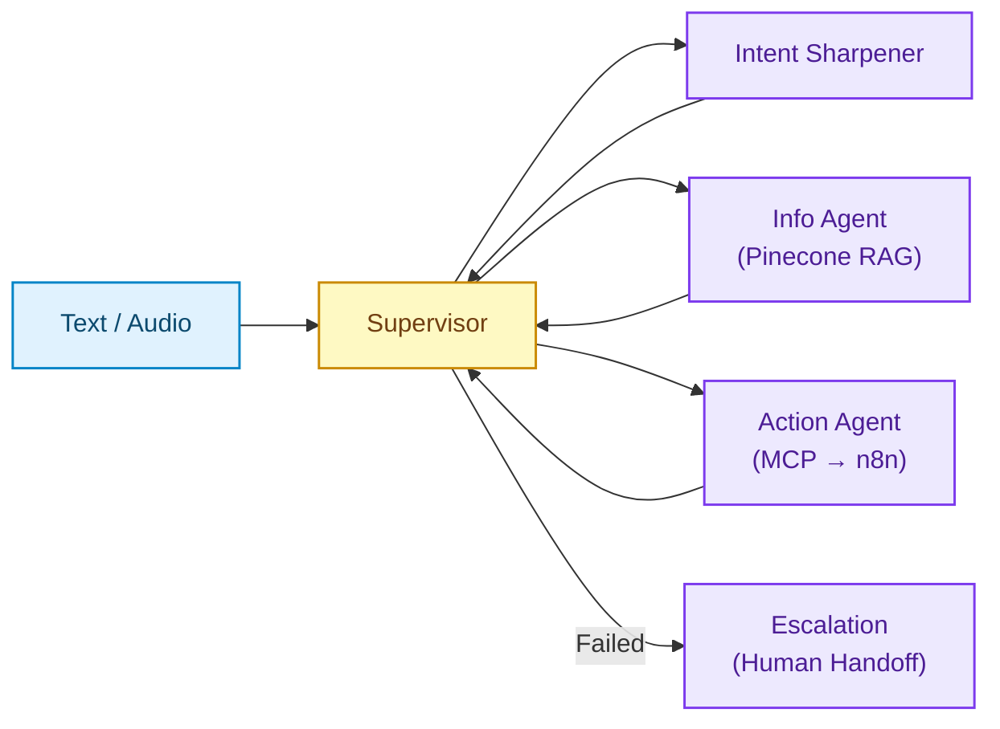

# ActionFlow AI — Travel Customer Support Automation


## Why It Matters

Travel support averages [2–12 hours response time](https://www.mightytravels.com/2024/10/how-major-airlines-customer-service-response-times-compare-analysis-of-7-leading-carriers-in-2024/). [83% of customers expect immediate response](https://www.zendesk.com/blog/customer-service-response-time/). Traditional chatbots answer questions but can't act — the traveler still navigates portals, fills forms, and waits.

ActionFlow **understands, decides, and executes**: policy lookup, cancellation, refund, and rebooking from a single message. One conversation. Multiple parallel actions. No waiting.

## Performance Targets

| Metric | Target | Method |
|--------|--------|--------|
| End-to-end response | < 3s | LangGraph routing + parallel n8n workflows |
| Voice latency (STT→TTS) | < 500ms | AssemblyAI streaming + ElevenLabs |
| Policy retrieval accuracy | > 90% | Pinecone semantic search with source attribution |
| Channel continuity | 100% | Redis session state across Web / WhatsApp / Voice |

> **Note:** These are design targets based on component-level benchmarks, not production measurements yet. Production metrics will be published after pilot deployment.

## Demo

```
Traveler: "Cancel my Amsterdam hotel for tomorrow. My flight was changed."

ActionFlow:
├─ Supervisor       → Intent: hotel cancellation | Urgency: high
├─ Info Agent       → Retrieves cancellation policy
│   └─ Result: Free cancellation until today, €142 refundable
├─ Action Agent     → "Your hotel allows free cancellation and a €142 refund.
│                      Shall I proceed?"
├─ Traveler         → "Yes, cancel it"
├─ Action Agent     → Triggers parallel n8n workflows:
│   ├─ Booking API  → Cancel reservation
│   ├─ Payment      → Initiate €142 refund
│   └─ Email        → Send confirmation
└─ Response         → "Cancelled. Refund in 3–5 business days."
```

**Key insight:** The Supervisor classifies urgency before routing — a same-day cancellation skips clarification and goes straight to action. Non-urgent requests go through the Intent Sharpener first.

<details>
<summary><strong>Trip Planning Demo (multi-turn with clarification)</strong></summary>

```
Traveler: "I want to visit Paris"

ActionFlow:
├─ Supervisor         → Intent: trip planning | Details missing
├─ Intent Sharpener   → "When are you planning to travel?"
│                      → "What is your approximate budget?"
├─ Traveler           → "Mid-May, 1000 euros."
├─ Supervisor         → Context complete → routes to Action Agent
├─ Action Agent       → Searches flights + hotels
│   └─ "Best match: TK1823 + Mercure Paris Centre — €1,650 for 2 people."
├─ Traveler           → "Book it"
├─ Action Agent       → Parallel n8n workflows:
│   ├─ Flight booking confirmed
│   ├─ Hotel booking confirmed
│   └─ Confirmation email sent
└─ Response           → "Your Paris trip is booked. Details sent to your email."
```

This scenario shows the Intent Sharpener collecting missing constraints (dates, budget) before any action is taken.

</details>

## Architecture



The Supervisor routes every message by intent and urgency. Agents operate independently — the Info Agent can answer a policy question while the Action Agent processes a cancellation. n8n workflows run in parallel: payment failure doesn't block email confirmation. MCP (Model Context Protocol) standardizes all tool interfaces, so switching LLM providers requires zero tool rewrites.

**Key insight:** Redis preserves full conversation state across channels. A traveler can start on web chat, switch to WhatsApp at the airport, and finish with voice — no context lost.

## Agents

| Agent | When It Activates | What It Does |
|-------|-------------------|--------------|
| **Supervisor** | Every message | Classifies intent + urgency, routes to the right agent |
| **Intent Sharpener** | Incomplete context | Asks targeted questions (dates, budget, passengers) before action |
| **Info Agent** | Policy questions | RAG search with source attribution (cancellation rules, baggage, refunds) |
| **Action Agent** | Execution requests | Books, cancels, refunds via MCP tools → n8n workflows |
| **Escalation** | AI can't resolve | Hands off to human with full transcript, attempted actions, urgency score |

## Technology Decisions

| Technology | Why This Over Alternatives |
|------------|---------------------------|
| **LangGraph** | Graph-based state machine handles conditional routing and conversation cycles that simple chains can't |
| **MCP** | LLM-agnostic tool protocol — switch providers without rewriting integrations |
| **n8n** | Self-hosted, no per-execution cost (vs Zapier). Visual debugging for complex booking flows |
| **Pinecone** | Managed vector DB with zero infra overhead. Sufficient for policy-scale datasets |
| **Redis** | Sub-ms latency for session state. Enables cross-channel continuity |
| **AssemblyAI / ElevenLabs** | Strong Turkish + English accuracy. Handles airport background noise |

## Quick Start

```bash
git clone https://github.com/yourusername/actionflow-ai.git
cd actionflow-ai
cp .env.example .env   # Add API keys: OpenAI, Pinecone, Twilio, AssemblyAI, ElevenLabs
docker-compose up -d   # Takes 3–5 min on first run
curl http://localhost:8000/health
```

| Service | URL |
|---------|-----|
| Web Chat | http://localhost:3000 |
| API Docs | http://localhost:8000/docs |
| n8n Workflows | http://localhost:5678 |
| Grafana | http://localhost:3001 |

---

Questions or collaboration: kadirqokdeniz@hotmail.com
