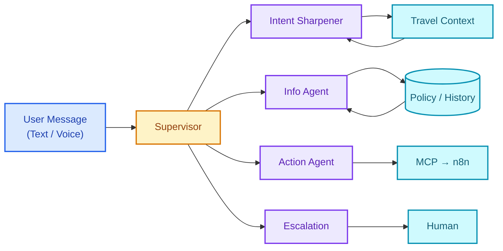

# ActionFlow AI — Travel Customer Support Automation


## Problem

Travel support fails when travelers need it most. [Average response time for travel customer service: 2-12 hours](https://www.mightytravels.com/2024/10/how-major-airlines-customer-service-response-times-compare-analysis-of-7-leading-carriers-in-2024/). [83% of customers expect immediate response for urgent issues](https://www.zendesk.com/blog/customer-service-response-time/). Flight changed, hotel needs cancellation, refund unclear — traveler stuck on hold while boarding starts.

Traditional chatbots answer questions but can't act. Customer still has to navigate portals, fill forms, wait for confirmation. Each step adds friction. Each friction point loses customers.

## Solution

An AI assistant that **understands, decides, and executes** — not just responds.

Multi-agent architecture handles the full journey: policy questions, reservation changes, cancellations, refunds, and rebooking — all from a single conversation. Automated workflows execute actions in parallel. Multi-channel presence (Web, WhatsApp, Voice) meets travelers wherever they are.

One message. Multiple actions. No waiting.

## Demo Video

🎬 *Recording in progress — Phase 1 completion*

## Demo Scenario

```
Traveler: "I want to visit Paris"

ActionFlow:
├─ Supervisor         → Intent: trip planning | Details missing
├─ Intent Sharpener   → Asks follow-up questions:
│   ├─ "When are you planning to travel?"
│   └─ "What is your approximate budget?"
├─ Traveler           → "Mid-May, 1000 euros."
├─ Supervisor         → Intent confirmed | Context complete
├─ Action Agent       → Searches flights and hotels
├─ Response           → "I found 3 flight options and 5 hotels.
│                        Would you like to review them?"
├─ Traveler           → "Show me the best option"
├─ Action Agent       → Presents recommendation:
│   └─ "Best match: TK1823 + Mercure Paris Centre.
│       Total price: €1,650 for 2 people."
├─ Action Agent       → Requests confirmation:
│   └─ "Would you like me to proceed with the booking?"
├─ Traveler           → "Yes, book it"
├─ Action Agent       → Triggers n8n workflow:
│   ├─ Flight Booking → Confirm flight reservation
│   ├─ Hotel Booking  → Confirm hotel reservation
│   └─ Email          → Send booking confirmation
└─ Response           → "Your trip to Paris is booked successfully.
                         Confirmation details have been sent to your email."
```

```
Traveler: "Cancel my Amsterdam hotel for tomorrow. My flight was changed."

ActionFlow:
├─ Supervisor         → Intent: hotel cancellation | Urgency: high
├─ Info Agent         → Retrieves cancellation policy
├─ Info Agent         → Result: Free cancellation until today, €142 refundable
├─ Action Agent       → Presents confirmation request:
│   └─ "Your hotel allows free cancellation and a €142 refund.
│       Do you want me to proceed with the cancellation?"
├─ Traveler           → "Yes, cancel it"
├─ Action Agent       → Triggers n8n workflow:
│   ├─ Booking API    → Cancel hotel reservation
│   ├─ Payment        → Initiate €142 refund
│   └─ Email          → Send cancellation confirmation
└─ Response           → "Your hotel reservation has been cancelled.
                         The refund will be processed within 3–5 business days."
```

## System Architecture

Supervisor agent routes based on intent and urgency. Specialized agents handle information retrieval and action execution independently. n8n workflows run in parallel — payment failure doesn't block email confirmation. Redis maintains conversation state across channel switches. Action Agent communicates with external services through MCP (Model Context Protocol), providing standardized tool interfaces that remain consistent regardless of LLM provider.



## Technology Decisions

| Technology | Purpose | Trade-off Reasoning |
|------------|---------|---------------------|
| **LangGraph** | Agent Orchestration | Graph-based state machine vs simple chains. Handles conditional routing, parallel execution, and conversation cycles needed for multi-step bookings. |
| **MCP** | Tool Protocol | Standardized tool interface vs custom integrations. LLM-agnostic design — switch providers without rewriting tool definitions. |
| **n8n** | Workflow Automation | Self-hosted, no per-execution cost vs Zapier. Visual debugging for complex booking flows. 400+ integrations including payment gateways. |
| **pgvector** | Policy Search | Single database for relational + vector data. Handles policy-scale datasets efficiently. |
| **Redis** | Session State | Sub-ms latency for conversation context. Critical for channel-switching scenarios (start on web, continue on WhatsApp). |
| **Twilio** | WhatsApp + SMS | Industry standard for travel notifications. Delivery receipts, media support, global reach. |
| **AssemblyAI** | STT | Strong multilingual accuracy (Turkish/English). Handles airport background noise. Real-time streaming. |
| **ElevenLabs** | TTS | Natural prosody for voice responses. Essential for hands-free airport/driving scenarios. |

## Agent Responsibilities

| Agent | Triggers | Example Actions |
|-------|----------|-----------------|
| **Supervisor** | Every message | Classifies intent and urgency, decides next state. Routes to Intent Sharpener if information is missing, Info Agent for policy questions, or Action Agent for execution. |
| **Intent Sharpener**| Incomplete or ambiguous intent | Asks targeted follow-up questions to collect missing details (dates, budget, passengers, preferences) before any action is taken. |
| **Info Agent** | Policy questions, comparisons | RAG search over cancellation policies, baggage rules, refund timelines. Source attribution included. |
| **Action Agent** | Reservations, cancellations, changes | Triggers booking API via MCP tools, initiates refunds, sends confirmations. Reports execution status. |
| **Escalation Agent** | Payment disputes, complex rebooking, angry customer | Handoff to human agent with full context: conversation history, attempted actions, customer tier, urgency score. |

## Core Capabilities

**Multi-Agent RAG**: Policy questions answered with source attribution. 

**Automated Actions**: Single message triggers parallel workflows. Cancellation + refund + confirmation execute simultaneously via n8n. No sequential bottlenecks.

**Multi-Channel Presence**: Unified backend serves Web Chat, WhatsApp, and Voice. Start conversation on laptop, continue on phone, finish with voice at airport — context preserved.

**Voice-First Design**: Real-time STT/TTS in Turkish and English. Sub-500ms latency. Designed for hands-free use during travel.

**Smart Escalation**: When AI can't help, human agent receives full context: conversation transcript, customer history, attempted solutions, urgency score. No "please repeat your issue."

**Guided Clarification**: When user intent is incomplete or ambiguous, the system proactively asks targeted follow-up questions to collect missing constraints (dates, budget, passengers, preferences) before taking any action.

## Quick Start

### 1. Clone and Setup
```bash
git clone https://github.com/yourusername/actionflow-ai.git
cd actionflow-ai
```

### 2. Configure Environment
```bash
cp .env.example .env
```

Required API keys:
```env
OPENAI_API_KEY=your_key_here
TWILIO_ACCOUNT_SID=your_sid_here
TWILIO_AUTH_TOKEN=your_token_here
ASSEMBLYAI_API_KEY=your_key_here
ELEVENLABS_API_KEY=your_key_here
# See .env.example for full list
```

### 3. Start Services
```bash
docker-compose up -d
```

> **Note:** Initial startup takes **3-5 minutes** for model downloads and n8n workflow import.

### 4. Verify Installation
```bash
curl http://localhost:8000/health
```

### 5. Access Services

| Service | URL | Purpose |
|---------|-----|---------|
| Frontend | http://localhost:3000 | Web chat interface |
| API Docs | http://localhost:8000/docs | Swagger documentation |
| n8n | http://localhost:5678 | Workflow editor |
| Grafana | http://localhost:3001 | Monitoring dashboards |

---

Questions or collaboration: kadirqokdeniz@hotmail.com
