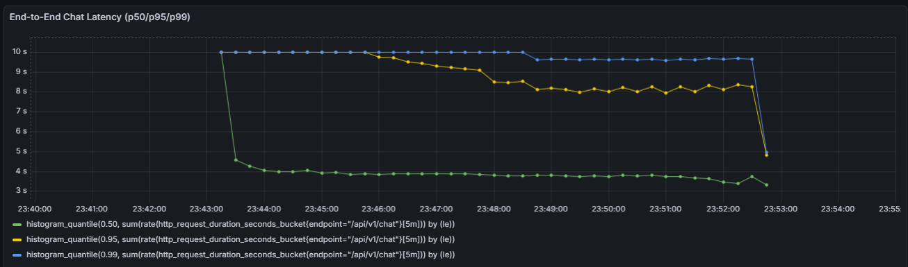
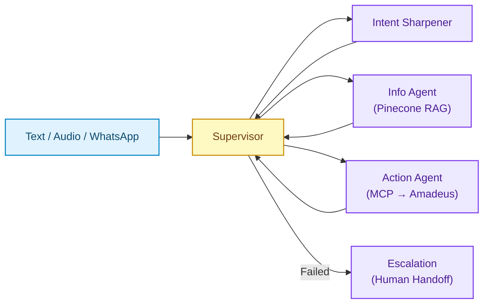

[](https://github.com/KadirGokdeniz/ActionFlow/actions/workflows/test.yml)


# ActionFlow AI — Travel Customer Support Automation


## Why It Matters

Travel support averages [2–12 hours response time](https://www.mightytravels.com/2024/10/how-major-airlines-customer-service-response-times-compare-analysis-of-7-leading-carriers-in-2024/). [83% of customers expect immediate response](https://www.zendesk.com/blog/customer-service-response-time/). Traditional chatbots answer questions but can't act — the traveler still navigates portals, fills forms, and waits.

ActionFlow **understands, decides, and executes**: policy lookup, cancellation, refund, and rebooking from a single message. One conversation. Multiple parallel actions. No waiting.

## Results

- **~3.8s median end-to-end latency** (p95 ~9s) — Prometheus-measured over 107 live requests
- **3/3 n8n workflows verified** end-to-end — booking confirmation, cancellation & refund, escalation alert
- **121 tests passing in CI** — unit + integration across 7 categories
- **Scale:** 5 agents · 9 MCP tools · 3 n8n pipelines · 2 channels (Web + WhatsApp)

<p align="center">
  
  <br/>
  <em>End-to-end chat latency: p50 ~3.8s, p95 ~9s, p99 hits 10s histogram ceiling.</em>
</p>

> Latency figures exported from the running service via Prometheus and visualized in Grafana,
> captured over a demo window (107 chat requests across varied intents) — representative, not production-scale.

## Demo

```
Traveler: "Cancel my Amsterdam hotel for tomorrow. My flight was changed."

ActionFlow:
├─ Supervisor       → Intent: hotel cancellation | Urgency: high
├─ Info Agent       → Retrieves cancellation policy
│   └─ Result: Free cancellation until today, €142 refundable
├─ Action Agent     → "Your hotel allows free cancellation and a €142 refund.
│                      Shall I proceed?"
├─ Traveler         → "Yes, cancel it"
├─ Action Agent     → Triggers parallel n8n workflows:
│   ├─ Booking API  → Cancel reservation
│   ├─ Payment      → Initiate €142 refund
│   └─ Email        → Send confirmation
└─ Response         → "Cancelled. Refund in 3–5 business days."
```

**Key insight:** The Supervisor classifies urgency before routing — a same-day cancellation skips clarification and goes straight to action. Non-urgent requests go through the Intent Sharpener first.

<details>
<summary><strong>Trip Planning Demo (multi-turn with clarification)</strong></summary>

```
Traveler: "I want to visit Paris"

ActionFlow:
├─ Supervisor         → Intent: trip planning | Details missing
├─ Intent Sharpener   → "When are you planning to travel?"
│                      → "What is your approximate budget?"
├─ Traveler           → "Mid-May, 1000 euros."
├─ Supervisor         → Context complete → routes to Action Agent
├─ Action Agent       → Searches flights + hotels
│   └─ "Best match: TK1823 + Mercure Paris Centre — €1,650 for 2 people."
├─ Traveler           → "Book it"
├─ Action Agent       → Parallel n8n workflows:
│   ├─ Flight booking confirmed
│   ├─ Hotel booking confirmed
│   └─ Confirmation email sent
└─ Response           → "Your Paris trip is booked. Details sent to your email."
```

This scenario shows the Intent Sharpener collecting missing constraints before any action is taken.

</details>

<details>
<summary><strong>Live Flight Booking — verified with real Amadeus API</strong></summary>

```
User: "Book a flight from IST to CDG on 2026-05-22 for 1 adult"

ActionFlow:
├─ Supervisor    → Intent: REACTIVE (origin + dest + date present)
│                  → routes directly to Action Agent
├─ Action Agent  → search_flights(IST, CDG, 2026-05-22, adults=1)
│   └─ Amadeus sandbox returns real results:
│        1. Turkish Airlines TK1827 — 150 EUR | 08:30 → 10:45 | 0 stops
│        2. Air France AF1391       — 160 EUR | 09:15 → 11:30 | 0 stops
│        3. Lufthansa LH1056       — 180 EUR | 07:00 → 12:00 | 1 stop

User: "Option 1"

├─ Action Agent  → CONFIRM phase
│   └─ "Turkish Airlines TK1827 | IST → CDG | 2026-05-22 | 150 EUR
│        Would you like to proceed with this booking?"

User: "Yes"

├─ Action Agent  → BOOK phase
└─ Response      → "✅ Booking Confirmed! Reference: #A3F29B1C
                    A confirmation email has been sent. Have a great flight!"
```

Real Amadeus sandbox prices, real flight numbers, real departure times.
State preserved in Redis across all turns via `action_phase` field.

</details>

## Architecture


```mermaid
flowchart LR
    INPUT["Text / Audio / WhatsApp"] --> SUP["Supervisor"]

    SUP --> SHARP["Intent Sharpener"]
    SHARP --> SUP

    SUP --> INFO["Info Agent<br/>(Pinecone RAG)"]
    INFO --> SUP

    SUP --> ACT["Action Agent<br/>(MCP → Amadeus)"]
    ACT --> SUP

    SUP -->|Failed| ESC["Escalation<br/>(Human Handoff)"]

    classDef input fill:#e0f2fe,stroke:#0284c7,stroke-width:1.5px,color:#0c4a6e
    classDef routing fill:#fef9c3,stroke:#ca8a04,stroke-width:1.5px,color:#713f12
    classDef agent fill:#ede9fe,stroke:#7c3aed,stroke-width:1.5px,color:#4c1d95

    class INPUT input
    class SUP routing
    class SHARP,INFO,ACT,ESC agent
```

The Supervisor routes every message by intent and urgency. Agents operate independently. MCP (Model Context Protocol) standardizes all tool interfaces, so switching LLM providers requires zero tool rewrites.

**Key insight:** Redis preserves full conversation state across channels. A traveler can start on web chat, switch to WhatsApp at the airport — no context lost.

## Agents

| Agent | When It Activates | What It Does |
|-------|-------------------|--------------|
| **Supervisor** | Every message | Classifies intent + urgency, routes to the right agent |
| **Intent Sharpener** | Incomplete context | Asks targeted questions (dates, budget, passengers) before action |
| **Info Agent** | Policy questions | RAG search with source attribution (cancellation rules, baggage, refunds) |
| **Action Agent** | Execution requests | Searches flights via Amadeus, confirms selection, processes booking |
| **Escalation** | AI can't resolve | Hands off to human with full transcript, attempted actions, urgency score |

## Booking Flow State Machine

The Action Agent uses an explicit `action_phase` field (replace semantics, not append) to track booking progress across turns:

```
None → searching → presented → confirming → booked → completed
```

This solves a fundamental LangGraph challenge: `completed_tasks` uses an `add` reducer (items can only be appended, never removed), making phase reversal impossible. The `action_phase` field uses simple assignment, enabling clean state transitions.

## Technology Decisions

| Technology | Why This Over Alternatives |
|------------|---------------------------|
| **LangGraph** | Graph-based state machine handles conditional routing and conversation cycles that simple chains can't |
| **MCP** | LLM-agnostic tool protocol — switch providers without rewriting integrations |
| **Amadeus API** | Direct GDS access for real flight search and booking (sandbox + production) |
| **n8n** | Self-hosted, no per-execution cost (vs Zapier). Visual debugging for complex booking flows |
| **Pinecone** | Production-ready semantic search with zero infra management |
| **Redis** | Sub-ms latency for session state. `action_phase` field persisted across turns |
| **OpenAI Realtime API** | Single WebSocket for STT+LLM+TTS (~500ms vs 3–5s with separate services) |

## Quick Start

```bash
git clone https://github.com/KadirGokdeniz/ActionFlow.git
cd ActionFlow
cp .env.example .env   # Add API keys: OpenAI, Amadeus, Pinecone, Twilio
docker compose up -d   # Takes 3–5 min on first run
curl http://localhost:8000/health/live
```

| Service | URL |
|---------|-----|
| Web Chat | http://localhost:5173 |
| API Docs | http://localhost:8000/docs |
| n8n Workflows | http://localhost:5678 |
| Grafana | http://localhost:3001 |
| Prometheus | http://localhost:9090 |

## Test Coverage

```
121 tests passing | pytest tests/unit
├─ Booking flow:     19 tests (action_phase state machine)
├─ Supervisor:       11 tests (routing decisions)
├─ Orchestrator:     14 tests (chat() interface)
├─ Intent Sharpener: 13 tests (travel context collection)
├─ Action Agent:     15 tests (phase detection helpers)
├─ Circuit Breaker:   5 tests (Amadeus resilience)
└─ Infrastructure:   44 tests (Redis, mappers, cache, logging)
```

---

Questions or collaboration: kadir@gokdeniz.co